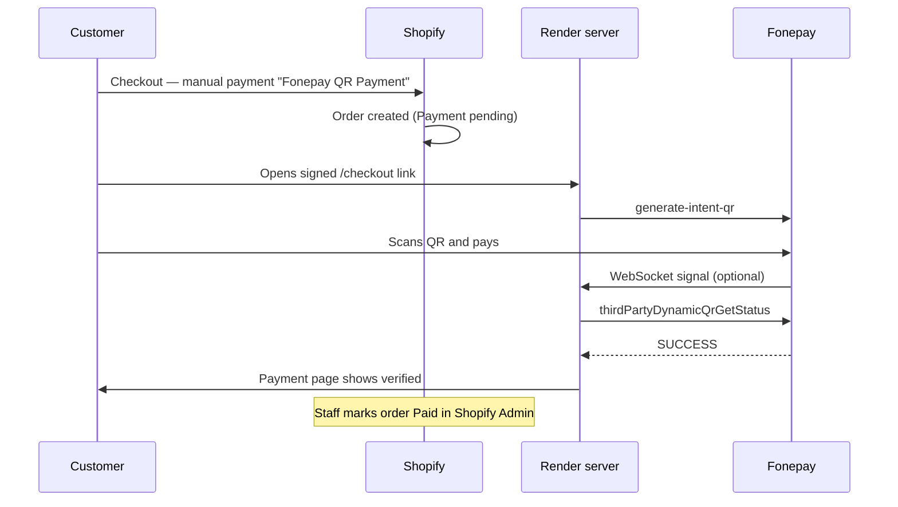

# Fonepay + Shopify production guide (manual mark-paid mode)

**Live service:** `https://nte-fonepay-integration.onrender.com`

This guide matches the current setup: **Fonepay API verifies payment**; **Shopify orders are marked paid manually** in Admin until you add a `shpat_` token later.

---

## Payment flow



**Rule:** The server only sets status to `paid` after **`thirdPartyDynamicQrGetStatus`** returns success — not from WebSocket or webhook alone.

---

## Part 1 — Shopify payment method

1. **Shopify Admin** → **Settings** → **Payments**
2. **Manual payment methods** → **Add manual payment method**
3. Set:

| Field | Value |
|-------|--------|
| **Name** | `Fonepay QR Payment` |
| **Payment instructions** | After placing your order, please complete payment using the Fonepay QR link we provide. Keep the payment page open until you see confirmation. |

4. Save. Orders using this method stay **Payment pending** until you mark them paid.

---

## Part 2 — Connect Shopify order to Fonepay

Use the **numeric Shopify order ID** in the payment link (`{{ order.id }}` in notifications — not `#1001`).

### Signed checkout URL

```text
https://nte-fonepay-integration.onrender.com/checkout
  ?order_id={SHOPIFY_ORDER_ID}
  &amount={ORDER_TOTAL_NPR}
  &timestamp={UNIX_MS}
  &signature={HMAC_HEX}
```

Generate locally:

```bash
npm run sign-url -- --order 5678901234 --amount 1500.00
```

Send that link by:

- Order confirmation email (manual or template)
- WhatsApp / SMS to customer
- Shopify Flow (if available)

**Do not** put `CHECKOUT_HMAC_SECRET` in the theme.

---

## Part 3 — After customer pays (your team)

### 1. Customer page

Customer sees **Payment verified** on the Fonepay page (after API confirmation).

### 2. Render logs

Look for a line like:

```text
[PAID] Fonepay verified (fonepay-api) | PRN/ref: SHP... | Shopify order: 5678901234 | amount NPR 1500 | → Mark this order PAID manually in Shopify Admin
```

### 3. Mark paid in Shopify

1. **Orders** → open the order (match **order ID** or customer name)
2. **Mark as paid** (or **Capture payment** depending on your Admin UI)
3. Fulfill the order as usual

### 4. Reconciliation

| Check | Where |
|-------|--------|
| Fonepay success | Render log `[PAID]` + Fonepay merchant portal |
| Shopify paid | Order shows **Paid** in Admin |
| Amount matches | Order total = NPR on payment link |

---

## Part 4 — Render environment variables

### Required now

| Variable | Example |
|----------|---------|
| `NODE_ENV` | `production` |
| `PUBLIC_BASE_URL` | `https://nte-fonepay-integration.onrender.com` |
| `CHECKOUT_HMAC_SECRET` | long random secret |
| `FONEPAY_USERNAME` / `PASSWORD` / `TERMINAL_ID` | from Fonepay |
| `FONEPAY_PRIVATE_KEY_B64` | base64 private key |
| `FONEPAY_BASE_URL` | `https://thirdparty-merchantapi.fonepay.com` |
| `ALLOWED_REDIRECT_HOSTS` | `nepal-tea-exchange.myshopify.com` |

### Optional (for later auto mark-paid)

| Variable | Notes |
|----------|--------|
| `SHOPIFY_STORE_DOMAIN` | `nepal-tea-exchange.myshopify.com` |
| `SHOPIFY_ADMIN_ACCESS_TOKEN` | `shpat_...` when you obtain it |

Without `shpat_`, `/health` shows `"shopifyMarkPaidMode": "manual"` — expected.

---

## Part 5 — Test payment status

1. Create a small Shopify order with **Fonepay QR Payment**
2. `npm run sign-url` with that order’s ID and total
3. Open link → pay via mobile banking
4. Confirm payment page shows **Payment verified**
5. Check Render logs for `[PAID] Fonepay verified`
6. **Manually** mark the order paid in Shopify Admin

---

## Part 6 — Security (already in code)

| Control | Status |
|---------|--------|
| Paid only after `thirdPartyDynamicQrGetStatus` SUCCESS | Yes |
| WebSocket/webhook trigger API re-check (retries) | Yes |
| Signed checkout URLs | Yes |
| Redirect host allowlist | Yes |
| No fake “paid” from browser | Yes |

---

## Part 7 — Later: automatic Shopify mark-paid

When Shopify provides an Admin API token (`shpat_`):

1. Set `SHOPIFY_ADMIN_ACCESS_TOKEN` and `SHOPIFY_STORE_DOMAIN` on Render
2. Redeploy
3. `/health` → `"shopifyMarkPaidMode": "automatic"`
4. Paid orders will call `orderMarkAsPaid` automatically (manual step still OK as backup)

---

## Health check

`GET https://nte-fonepay-integration.onrender.com/health`

```json
{
  "ok": true,
  "terminalSuffix": "9139",
  "checkoutSigning": true,
  "shopifyMarkPaidMode": "manual"
}
```

---

## Support

- **Fonepay:** PRN / reference tracing, terminal issues
- **Shopify:** manual payment method, order mark-paid
