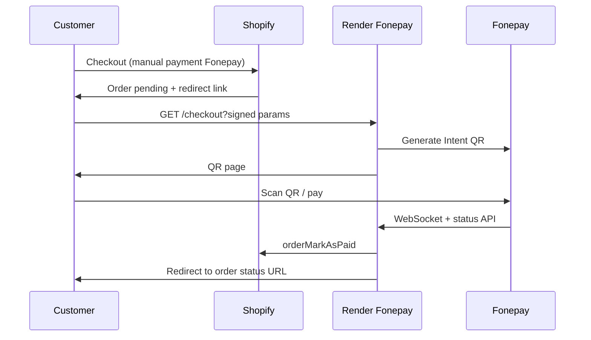

# Production setup: Fonepay + Shopify + Render

This guide covers Render configuration, security, and Shopify Admin steps for **Nepal Tea Exchange** (or any store using this service).

**Live service:** `https://nte-fonepay-integration.onrender.com`

---

## Part 1 — Render environment variables

In [Render Dashboard](https://dashboard.render.com) → your service → **Environment**, set:

| Variable | Required | Example / notes |
|----------|----------|-----------------|
| `NODE_ENV` | Yes | `production` |
| `PUBLIC_BASE_URL` | Yes | `https://nte-fonepay-integration.onrender.com` |
| `CHECKOUT_HMAC_SECRET` | Yes | Long random string (32+ chars). **Never commit.** |
| `FONEPAY_USERNAME` | Yes | From Fonepay |
| `FONEPAY_PASSWORD` | Yes | From Fonepay |
| `FONEPAY_TERMINAL_ID` | Yes | `2222440006139139` (live terminal) |
| `FONEPAY_PRIVATE_KEY_B64` | Yes | Base64 of `private.pem` (not the file on disk) |
| `FONEPAY_BASE_URL` | Yes | `https://thirdparty-merchantapi.fonepay.com` |
| `SHOPIFY_STORE_DOMAIN` | Yes | `nepal-tea-exchange.myshopify.com` |
| `SHOPIFY_ADMIN_ACCESS_TOKEN` | Yes | Custom app token (see Part 2) |
| `ALLOWED_REDIRECT_HOSTS` | Yes | `nepal-tea-exchange.myshopify.com` |
| `SHOPIFY_API_VERSION` | No | `2024-10` (default) |
| `FONEPAY_WEBHOOK_SECRET` | No | Set if Fonepay provides webhook signing |

Generate a checkout secret (PowerShell):

```powershell
[Convert]::ToBase64String((1..32 | ForEach-Object { Get-Random -Maximum 256 }) -as [byte[]])
```

Save → **Save Changes** → wait for deploy.

Verify:

```text
GET https://nte-fonepay-integration.onrender.com/health
```

Expect:

```json
{
  "checkoutSigning": true,
  "shopifyConfigured": true,
  "terminalSuffix": "9139"
}
```

---

## Part 2 — Shopify Admin app (mark orders paid)

1. **Shopify Admin** → **Settings** → **Apps and sales channels** → **Develop apps** → **Allow custom app development**
2. **Create an app** (e.g. `Fonepay Integration`)
3. **Configure Admin API scopes:**
   - `read_orders`
   - `write_orders` (required for `orderMarkAsPaid`)
4. **Install app** on the store → copy **Admin API access token** (shown once)
5. Paste into Render as `SHOPIFY_ADMIN_ACCESS_TOKEN`

When a customer pays, the server calls Shopify GraphQL `orderMarkAsPaid` so the order shows **Paid** in Admin.

---

## Part 3 — Shopify payment method

1. **Settings** → **Payments**
2. Under **Manual payment methods** → **Add manual payment method**
3. Name: **Fonepay QR** (or similar)
4. **Payment instructions** (customer-facing), for example:

   > After placing your order, you will be redirected to pay with Fonepay QR. Keep the payment page open until you see confirmation.

5. **Deactivate** conflicting test gateways if you are going live only with Fonepay.

### Redirecting customers to pay

Checkout must use a **signed URL** (tamper-proof). Unsigned URLs are rejected in production.

**Signed URL format:**

```text
https://nte-fonepay-integration.onrender.com/checkout
  ?order_id={SHOPIFY_NUMERIC_ORDER_ID}
  &amount={TOTAL_NPR_2_DECIMALS}
  &timestamp={UNIX_MS}
  &signature={HMAC_SHA256_HEX}
  &redirect_url={URL_ENCODED_HTTPS_SHOPIFY_ORDER_PAGE}
```

Generate a test link locally:

```bash
# .env must contain CHECKOUT_HMAC_SECRET and PUBLIC_BASE_URL
npm run sign-url -- --order 5678901234 --amount 1500.00 --redirect "https://nepal-tea-exchange.myshopify.com/account/orders/5678901234"
```

**Important:** `order_id` must be the numeric Shopify order ID (`{{ order.id }}` in Liquid), not the order name (`#1001`).

### Wiring redirect from Shopify

Choose one approach:

| Approach | Best for | How |
|----------|----------|-----|
| **A. Shopify Flow** | Shopify plan with Flow | On order created (pending payment) → HTTP request to your signer or email with pre-built link |
| **B. Custom Shopify app** | Full automation | App creates signed URL on `orders/create` webhook |
| **C. Payment instructions + email** | Simple start | Send signed link in order confirmation email (manual/script until app exists) |
| **D. Theme + backend** | Order status page | Backend endpoint returns signed URL; theme only links to your API |

**Do not** embed `CHECKOUT_HMAC_SECRET` in the theme or checkout.liquid.

---

## Part 4 — Security checklist (implemented in code)

| Control | Status |
|---------|--------|
| Signed checkout (`timestamp` + HMAC, 15 min expiry) | Required in production |
| Redirect URL allowlist (`ALLOWED_REDIRECT_HOSTS`) | Blocks open redirects |
| Removed `/api/notify` (fake “paid” posts) | Removed |
| Payment confirmed only via Fonepay API + WebSocket + webhook | Yes |
| Rate limit on `/checkout` | Yes |
| Helmet security headers + CSP (allows Shopify admin iframe) | Yes |
| CORS restricted to store domain | When `SHOPIFY_STORE_DOMAIN` set |
| Webhook HMAC (optional `FONEPAY_WEBHOOK_SECRET`) | Yes |
| Secrets only in Render env (`FONEPAY_PRIVATE_KEY_B64`) | Documented |
| Generic errors in production | Yes |
| Reduced Fonepay API logging in production | Yes |

### Still your responsibility

- Rotate `CHECKOUT_HMAC_SECRET` if leaked
- Use Render **paid** plan if you need always-on (free tier sleeps)
- Register webhook URL with Fonepay if they support it:  
  `https://nte-fonepay-integration.onrender.com/webhook/fonepay`
- Reconcile failed `markOrderAsPaid` from Render logs (orders paid in Fonepay but not in Shopify)

---

## Part 5 — End-to-end payment flow



---

## Part 6 — Go-live test plan

1. `/health` → `checkoutSigning: true`, `terminalSuffix: "9139"`
2. Create a **test order** on Shopify with Fonepay manual payment (small amount)
3. Generate signed URL with `npm run sign-url`
4. Open URL → scan QR → confirm payment page shows success
5. In Shopify Admin → order is **Paid**
6. Check Render logs for `Shopify order marked paid`

---

## Shopify app embed settings

If the app opens inside Shopify Admin and shows **refused to connect**:

1. Ensure latest `server.js` is deployed (CSP `frameAncestors` includes `admin.shopify.com` and `*.myshopify.com`).
2. In the custom app / Partner settings, try **Embedded app = false** if you only need the API token (no UI inside Admin).
3. Confirm `https://nte-fonepay-integration.onrender.com/health` works in a normal browser tab first.

---

## Part 7 — Render production recommendations

- **Instance:** Starter or higher (avoid cold start during checkout)
- **Health check path:** `/health`
- **Auto-deploy:** from `main` after you push this repo
- **Secrets:** never in git; use Render secret files / env only

---

## Support contacts

- **Fonepay:** terminal activation, PRN tracing, webhook signing
- **Shopify:** custom app scopes, Flow, checkout customization
